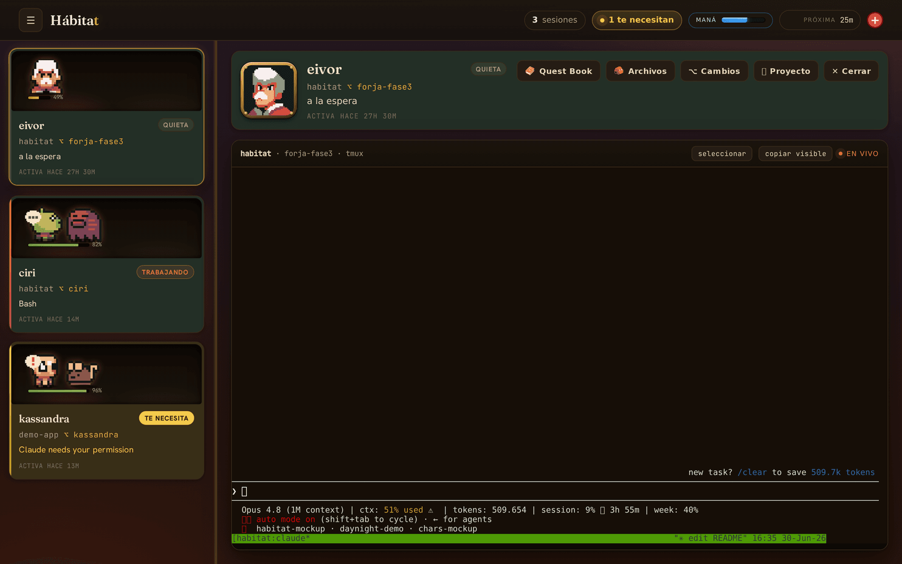
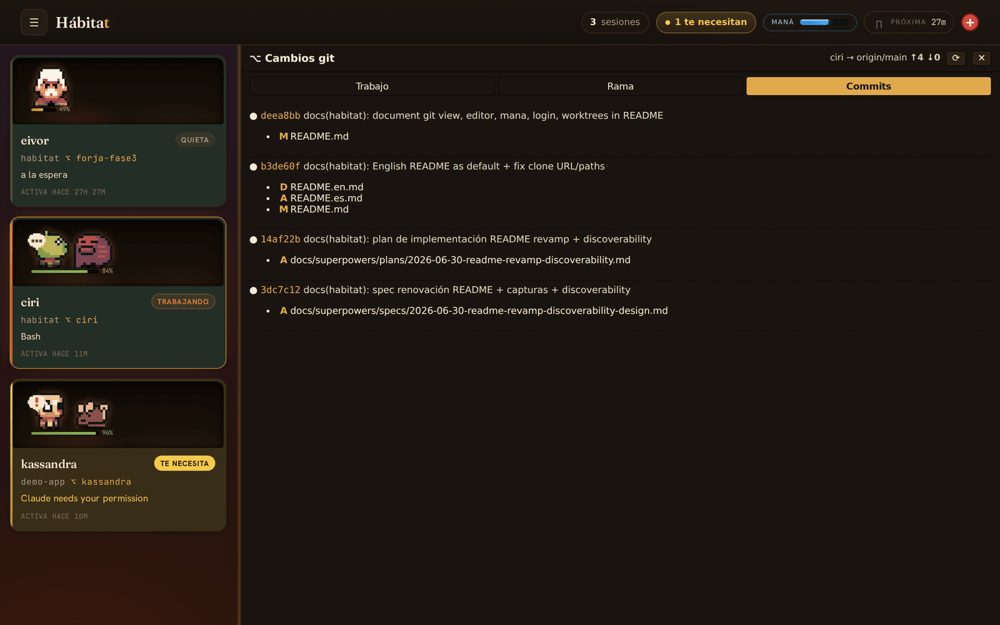
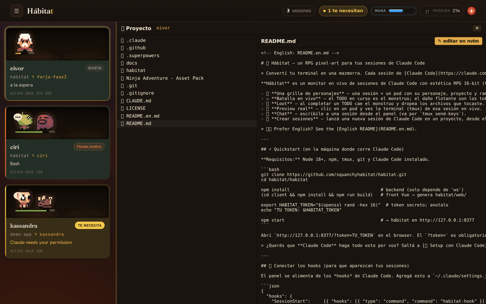
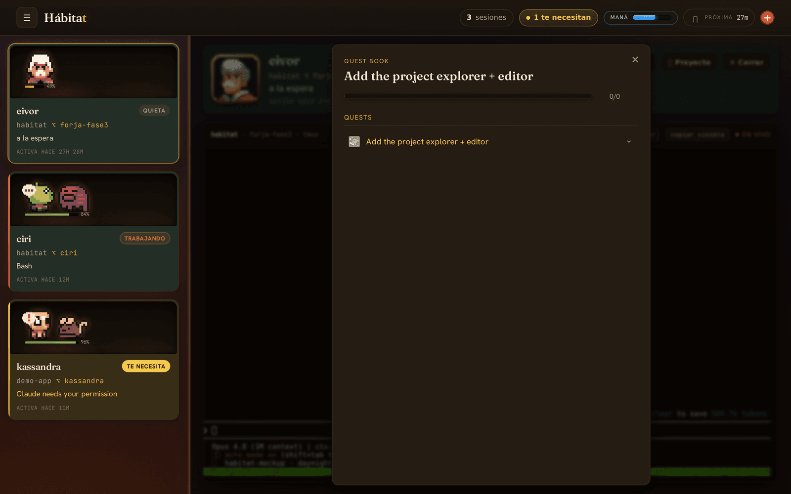
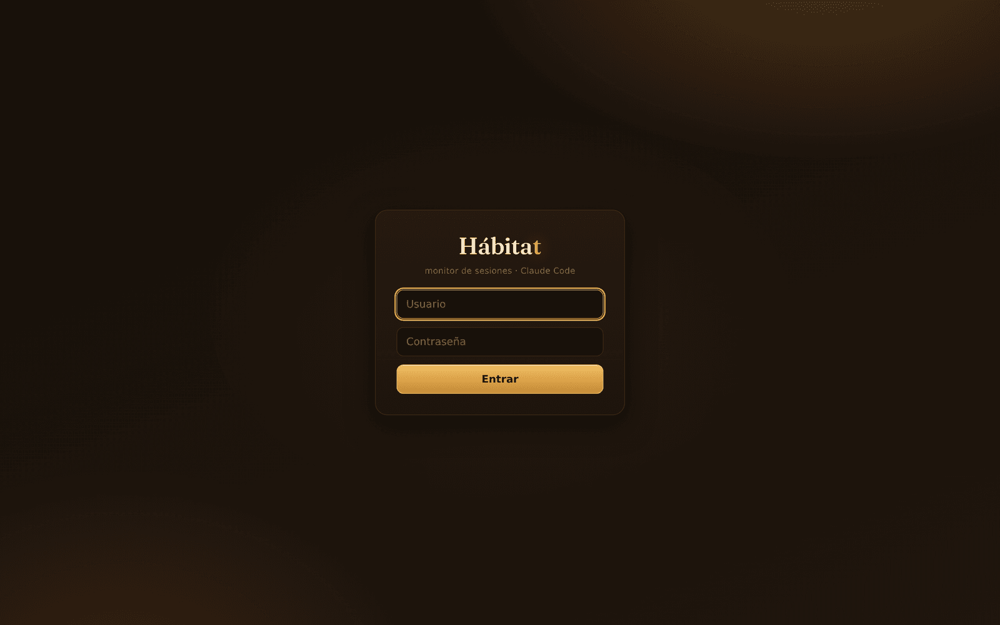

<!-- Español: README.es.md -->

# 🏰 Hábitat — a pixel-art RPG dashboard for your Claude Code sessions

> Turn your terminal into a dungeon. Each [Claude Code](https://claude.com/claude-code) session is a character on a grid; each in-progress TODO is a monster; the tokens it spends are the damage it deals. Watch all your sessions fight in real time from a single screen.



**Hábitat** is a live Claude Code dashboard with 16-bit RPG flair (medieval theme, sprites from the *Ninja Adventure* pack). It's not cosmetic fluff: every number you see is real session telemetry captured through Claude Code's *hooks*. It doubles as an **observability** and **monitor** layer for your whole Claude Code workflow — including **multi-agent** parallel branches — and gives you a project explorer, embedded editor, and git workflow panel, all from one browser tab.

> 🇪🇸 ¿Preferís español? Mirá el [README en español](README.es.md).

- 🧙 **A grid of characters** — one session = one pod with its character, project and git branch.
- ⚔️ **Live battle** — the in-progress TODO is the monster; floating damage is the step's tokens; *stamina* is how much context you have left (real data from the Claude statusline).
- 🎁 **Loot** — completing a TODO kills the monster and drops the files you touched.
- 👁️ **Real preview** — click a pod to see that session's terminal (tmux) live.
- 💬 **Chat** — message a session from the panel (sent via `tmux send-keys`).
- ➕ **Spawn sessions** — launch a new Claude Code session in a project, right from the header.
- 🌿 **Git changes view** — see status, diff, stage/unstage/discard files, commit, push, pull, and merge, per session, right in the detail panel. Write actions are gated by `HABITAT_ALLOW_GIT_WRITE`.
- 📁 **Project explorer + embedded editor** — browse the session's file tree, preview files, and open them in nvim (via a dedicated tmux window) from the browser.
- 🌙 **Mana + day/night cycle** — Claude's 5-hour usage window is represented as mana; the background shifts as the window fills and resets.
- 📖 **Quest Book** — a per-session quest log and dialogue view, built from the TODO history.
- 📱 **Tablet/phone access** — Tailscale Serve (HTTPS inside your tailnet) + username/password login with a persistent cookie session. Touch-friendly UX.
- 🌲 **Worktrees / multi-agent** — each spawned session gets its own git worktree and tmux session, so multiple agents work the same repo in parallel on separate branches.
- 🔥 **Warm Forge redesign** — a premium visual overhaul with self-hosted fonts and Tailwind v4.
- ⚙️ **Settings** — manage projects from the UI: per-project colors, character allowlists. Persisted across restarts.

---

## 📸 Screenshots

<table>
  <tr>
    <td width="50%"><br><sub><b>Git changes</b> — status, diff, stage, commit, push & merge, per session.</sub></td>
    <td width="50%"><br><sub><b>Explorer + editor</b> — browse the tree, preview files, open them in nvim.</sub></td>
  </tr>
  <tr>
    <td width="50%"><br><sub><b>Quest Book</b> — a per-session quest log built from the TODO history.</sub></td>
    <td width="50%"><br><sub><b>Login</b> — username/password access for tablet & phone over Tailscale.</sub></td>
  </tr>
</table>

---

## ⚡ Quickstart (on the machine where Claude Code runs)

**Requirements:** Node 18+, npm, tmux, git, and Claude Code installed.

```bash
git clone https://github.com/squanchymnonm/habitat.git
cd habitat/habitat

npm install                                   # backend (only depends on 'ws')
(cd client && npm install && npm run build)   # Vue front → generates habitat/web/

export HABITAT_TOKEN="$(openssl rand -hex 16)"  # secret token; write it down
echo "YOUR TOKEN: $HABITAT_TOKEN"

npm start                                     # → hábitat on http://127.0.0.1:8377
```

Open `http://127.0.0.1:8377/?token=YOUR_TOKEN` in your browser. The `?token=` is required (the WebSocket uses it).

> Want **Claude Code** to do all this for you? Jump to [🤖 Setup with Claude Code](#-setup-with-claude-code).

---

## 🪝 Wire up the hooks (so your sessions show up)

The panel is fed by Claude Code's *hooks*. Add this to `~/.claude/settings.json`:

```json
{
  "hooks": {
    "SessionStart":     [{ "hooks": [{ "type": "command", "command": "habitat-hook" }] }],
    "UserPromptSubmit": [{ "hooks": [{ "type": "command", "command": "habitat-hook" }] }],
    "PreToolUse":       [{ "matcher": "*", "hooks": [{ "type": "command", "command": "habitat-hook" }] }],
    "PostToolUse":      [{ "matcher": "*", "hooks": [{ "type": "command", "command": "habitat-hook" }] }],
    "Notification":     [{ "hooks": [{ "type": "command", "command": "habitat-hook" }] }],
    "PreCompact":       [{ "hooks": [{ "type": "command", "command": "habitat-hook" }] }],
    "Stop":             [{ "hooks": [{ "type": "command", "command": "habitat-hook" }] }],
    "SessionEnd":       [{ "hooks": [{ "type": "command", "command": "habitat-hook" }] }]
  }
}
```

And in your shell (`~/.bashrc` / `~/.zshrc` of the environment where you open Claude Code):

```bash
export HABITAT_TOKEN="<the same token>"
export PATH="$PATH:$HOME/habitat/habitat/hook"   # so 'habitat-hook' resolves
```

> **Important for preview/chat:** run your Claude Code sessions **inside tmux**, with the tmux session name = basename of the project directory (e.g. `~/dev/my-app` → `tmux new -s my-app`). That's how the panel matches a session to its terminal. Sessions created with **"+ NEW SESSION"** already do this automatically.

---

## 🌲 Real stamina from the Claude statusline

Stamina (the orb on each pod) reflects `100 − context_window.used_percentage` — the real context usage Claude Code tracks per session. To feed it, wire the statusline hook in `~/.claude/settings.json`:

```json
{
  "statusLine": {
    "type": "command",
    "command": "bash /path/to/habitat/habitat/hook/habitat-statusline"
  }
}
```

Export `HABITAT_TOKEN` in the same environment. Set `HABITAT_URL_STATUS` if the server isn't on the default `http://127.0.0.1:8377/status`. `HABITAT_STATUSLINE_DELEGATE` controls which existing statusline renderer the wrapper delegates to (default: `bash $HOME/.claude/statusline-command.sh`).

---

## 📱 Remote access from tablet or phone

The server binds to loopback by design. For tablet/phone access without SSH, use **Tailscale Serve** (HTTPS inside your tailnet). Setup takes about 5 minutes. See [`habitat/README.md`](habitat/README.md) for the full Tailscale + systemd setup (including the critical `KillMode=process` detail that keeps sessions alive across restarts).

**Username/password login** (cookie session, 1-day TTL with sliding renewal):

```bash
export HABITAT_USER=yourname
export HABITAT_PASSWORD_HASH="$(cd habitat && printf 'yourpassword\n' | npm run --silent hash-password | sed 's/^HABITAT_PASSWORD_HASH=//')"
```

The cookie is `HttpOnly; Secure; SameSite=Strict`. `HABITAT_TOKEN` continues to work as a Bearer token (hooks, statusline) and as a `?token=` URL fallback.

---

## 💻 Use it from another machine (server → your computer)

The server binds to **loopback** on purpose: it's never exposed to the internet. To reach it from your PC, use an SSH tunnel:

```bash
# on your PC
ssh -N -L 8377:127.0.0.1:8377 user@your-server
```

Keep that terminal open and open `http://127.0.0.1:8377/?token=YOUR_TOKEN` in your local browser.

---

## 🤖 Setup with Claude Code

Got Claude Code? Clone the repo, cd into it, run `claude` and paste this prompt. It will understand the project and leave it running:

```
You are in the habitat repo (Hábitat): a pixel-art RPG monitor and dashboard for Claude Code sessions.
Before touching anything, read README.md and habitat/README.md to understand
the architecture (Node server in habitat/server, Vue front in habitat/client, hook in habitat/hook).

Then get it running on this machine, step by step, verifying each one:
1. Check that node 18+, npm, tmux and git are present. If something is missing, tell me and stop.
2. Install dependencies: `cd habitat && npm install` and `cd habitat/client && npm install`.
3. Build the front: `npm run build` in habitat/client (generates habitat/web/).
4. Generate a token with `openssl rand -hex 16`, show it to me and keep it for the next steps.
5. Start the server with that HABITAT_TOKEN and confirm it responds on http://127.0.0.1:8377.
6. Show me the hooks block I need to put in ~/.claude/settings.json and offer to add it
   yourself (without clobbering hooks I already have). Remind me to export HABITAT_TOKEN and
   add habitat/hook to PATH.
7. Explain in 3 lines how to open the GUI (with ?token=) and how to spawn sessions from the
   panel if I want to enable HABITAT_ALLOW_SPAWN + HABITAT_PROJECTS.

Do not expose the server beyond loopback. If anything fails, show me the error and stop.
```

---

## 🛠️ How it's built

```
Your PC (browser)  ──SSH tunnel / VPN / Tailscale──▶  Server
                                                        ├─ habitat server   HTTP + WebSocket  (127.0.0.1:8377)
                                                        ├─ tmux sessions running `claude`
                                                        └─ hook habitat-hook   ──POST /hooks──▶ server
```

- **`habitat/server/`** — Node (ESM, no TypeScript), single dependency `ws`. HTTP serves the front + API endpoints; WebSocket pushes state. Tests with `node --test` (**229 passing**). RPG state is derived from hooks (TodoWrite → monster/quest; transcript tokens → damage/stamina; statusline → mana/usage window).
- **`habitat/client/`** — Vue 3 + TypeScript + Vite. Builds to `habitat/web/` (served by the server).
- **`habitat/hook/habitat-hook`** — forwards Claude Code events to the server.
- **Security (Law 1):** Bearer token + loopback bind on every endpoint; spawning sessions additionally requires the `HABITAT_ALLOW_SPAWN` flag + a projects list managed from Settings. Git write actions require `HABITAT_ALLOW_GIT_WRITE`. tmux commands run via `execFile` (no shell). Never expose to the internet without a VPN or Tailscale.

Design specs and plans live in `docs/superpowers/`.

**HTTP routes:** `/hooks` `/preview` `/projects` `/projects/browse` `/spawn` `/status` `/tree` `/file` `/files` `/files/upload` `/editor/open` `/git/status` `/git/diff` `/git/action` `/questbook` `/settings` `/login` `/logout` `/auth/me` `/term` `/ws`

---

## ⚙️ Environment variables

### Core

| Variable | Default | Purpose |
|---|---|---|
| `HABITAT_TOKEN` | `''` | Bearer token for hooks/WS/GUI. **Always set it.** |
| `HABITAT_PORT` | `8377` | HTTP port. |
| `HABITAT_BIND` | `127.0.0.1` | Interface. Don't change without a VPN or Tailscale. |
| `HABITAT_URL` | `http://127.0.0.1:8377/hooks` | Hooks endpoint override (used by `habitat-hook`). |
| `HABITAT_STATE` | `.state.json` | Path to persisted session state file. |
| `HABITAT_SETTINGS` | `.settings.json` | Path to persisted UI settings file. |

### Spawn + projects

| Variable | Default | Purpose |
|---|---|---|
| `HABITAT_ALLOW_SPAWN` | `0` | `1` enables spawning sessions and managing projects from the panel. |
| `HABITAT_PROJECTS` | `''` | Colon-separated absolute paths to seed the project list on first run (managed via UI afterwards). |
| `HABITAT_PROJECTS_ROOT` | `''` | Root directory for the project browser in Settings. Required to add projects from the UI. |
| `HABITAT_PROJECTS_STATE` | `.projects.json` | Path to persisted projects list. |
| `HABITAT_WORKTREES_DIR` | `~/habitat-worktrees` | Root directory where git worktrees are created for spawned sessions. |
| `HABITAT_TMUX_SOCKET` | `habitat` | tmux socket name (`-L`). Isolates Hábitat sessions from your personal tmux. |

### Git

| Variable | Default | Purpose |
|---|---|---|
| `HABITAT_ALLOW_GIT_WRITE` | `0` | `1` enables write git actions (stage, unstage, discard, commit, push, pull, merge) from the panel. |

### Auth + login

| Variable | Default | Purpose |
|---|---|---|
| `HABITAT_USER` | `''` | Username for password login. Login form is only shown when both `HABITAT_USER` and `HABITAT_PASSWORD_HASH` are set. |
| `HABITAT_PASSWORD_HASH` | `''` | scrypt hash of the login password. Generate with `npm run hash-password` in `habitat/`. |
| `HABITAT_SESSION_TTL_MS` | `86400000` | Cookie session lifetime in ms (default 1 day, sliding renewal). |
| `HABITAT_COOKIE_SECURE` | `true` | Set to `false` only for plain-HTTP local testing (Tailscale uses HTTPS, keep `true`). |
| `HABITAT_SESSIONS` | `.sessions.json` | Path to persisted login sessions file (survives server restarts). |

### Editor + files

| Variable | Default | Purpose |
|---|---|---|
| `HABITAT_EDITOR` | `nvim` | Editor command launched in the tmux editor window when opening files. |
| `HABITAT_FILE_MAX_BYTES` | `1048576` (1 MB) | Maximum file size for inline file preview via `/file`. |
| `HABITAT_PREVIEW_LINES` | `30` | Number of terminal lines captured by `/preview`. |
| `HABITAT_UPLOAD_MAX_BYTES` | `26214400` (25 MB) | Default upload size cap via `/files/upload`. |
| `HABITAT_UPLOAD_PASSWORD` | `''` | Password that bypasses the upload size cap (sent in `X-Upload-Password` header). |

### Statusline

| Variable | Default | Purpose |
|---|---|---|
| `HABITAT_URL_STATUS` | `http://127.0.0.1:8377/status` | Statusline endpoint override (used by `habitat-statusline`). |
| `HABITAT_STATUSLINE_DELEGATE` | `bash $HOME/.claude/statusline-command.sh` | Existing statusline renderer to delegate to after posting usage data. |

---

## 📄 License

MIT — see [LICENSE](LICENSE).

## 🙏 Credits

- Sprites: **Ninja Adventure Asset Pack** (Pixel-Boy / AAA) — CC0.
- Built with [Claude Code](https://claude.com/claude-code).
